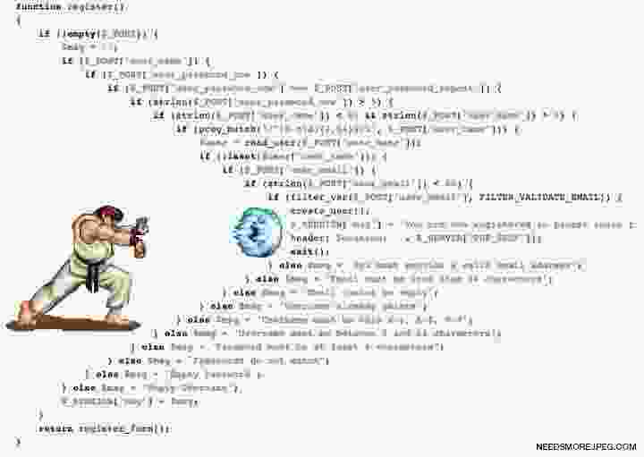
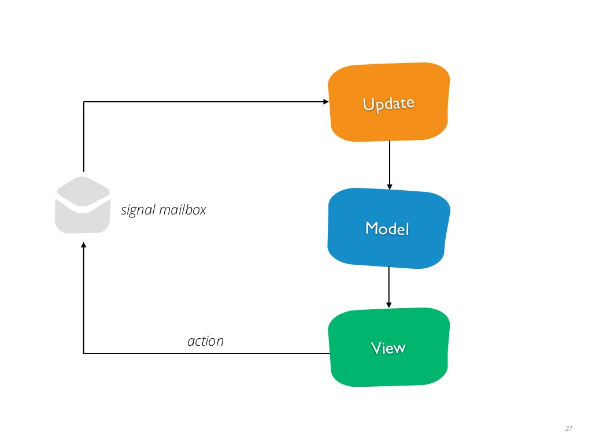

- title : Introduction à la programmation fonctionnelle (F#)
- author : Christophe Moinard
- theme : night
- transition : default

***

## Programmation fonctionnelle

<br />
<br />

### avec F#

<br />
<br />
Christophe Moinard - [@chr_moinard](http://www.twitter.com/chr_moinard)

***

### Intérêt programmation fonctionnelle

* Paradigme différent
* Concis
* Contraintes facilitant certaines problématiques
    * Typage fort -> compilateur strict
    * « pas d'effets de bord »
    * Concurrence, parallélisation, asynchronisme

---

### Sommaire

1. Programmation fonctionnelle
2. Spécificités F#
3. Écosystème

---

### Attention

Il y a des choses fausses dans cette présentation.


***

### 1. Programmation fonctionnelle

***

### Types

* Peu de concepts différents
* Immuables

---

### Immuables

    let v = 12 // compile
    v = 13     // ne compile pas
    
    let v' = 13

---

### Concepts différents

* Primitifs
* Produits / records
* Unions

---

### Produits / records

    // Tuples

    type MyIntTuple = int * int

    // int * int
    let pointTuple = 12, 11

    // string * float * int
    let t = "toto", 2.0, 13

    
    // Records
    type Point = {
        x: int
        y: int
    }

    let point = { x = 33; y = 5 }

---

### Unions
    
    type Boolean = True | False
    
    type Shape =
        | Point
        | Square of int
        | Rect of int * int

    let littleSquare = Square 3

    let bigRectangle = Rect (8374, 1374)

---

### Make the illegal state unrepresentable
<br />
#### Demo

***

### Fonctions

    // string -> string
    let shout message = message + " !!!"

    let shoutL33t = fun message -> message + " !!1"
    
    shout "Bonjour"    // "Bonjour !!!"

    "Bonjour" |> shout // "Bonjour !!!"

---

### Fonctions

* Pures
    * pas d'effets de bord
    * renvoient la même valeur quel que soit le contexte
    * faciles à paralléliser
* Un seul paramètre (currying / partialisation)

---

### Partialisation

    // int -> int -> int
    let add x y = x + y
    
    add 1 3

    // int -> int
    let increment = add 1

    increment 3

---

### Partialisation

    // currying
    // int ->  int -> int
    // int -> (int -> int)

    add 1 3
    increment 3
    3 |> increment
    3 |> add 1

***

### Cas simple

    // string -> Token
    let log login = // …

    // Token -> User
    let getUser token = // …

    // User -> Employee list
    let getAllSalaries user = // …

    
    // string -> Employee list
    let getAllSalariesFromLogin login = // ?

---

### Implémentation intuitive

    let getAllSalariesFromLogin login =
        let token = log login
        let user = getUser token
        let allSalaries = getAllSalaries user
        allSalaries

---

### Avec des |>

    let getAllSalariesFromLogin login =
        login
        |> log
        |> getUser
        |> getAllSalaries


---

### Avec des >>

    let getAllSalariesFromLogin =
        log >> getUser >> getAllSalaries


***

### Gestion des erreurs

* Pas de null
* Pas d'exceptions

    
    type Option<'a> =
        | Some of 'a
        | None

    type Result<'a, 'error> =
        | Success of 'a
        | Failure of 'error

---

### Cas avec Option

    // string -> Option<Token>
    let log login = // …

    // Token -> Option<User>
    let getUser token = // …

    // User -> Option<Employee list>
    let getAllSalaries user = // …

    
    // string -> Option<Employee list>
    let getAllSalariesFromLogin login = // ?

---

### Implémentation intuitive

    // string -> Option<Employee list>
    let getAllSalariesFromLogin login =
        let tokenOption = log login
        match tokenOption with
        | None -> None
        | Some token ->
            let userOption = getUser token
            match userOption with
            | None -> None
            | Some user ->
                let allSalariesOption = getAllSalaries user
                allSalariesOption

---

### Pyramid of doom

 

---

### Implémentation intuitive

    // string -> Option<Employee list>
    let getAllSalariesFromLogin login =
        let tokenOption = log login
        match tokenOption with
        | None -> None
        | Some token ->
            let userOption = getUser token
            match userOption with
            | None -> None
            | Some user ->
                let allSalariesOption = getAllSalaries user
                allSalariesOption

---

### Factorisation

    // ('a -> Option<'b>) -> Option<'a> -> Option<'b>
    let whenSome f v =
        match v with
        | None -> None
        | Some x -> f x

    let getAllSalariesFromLogin login =
        login
        |> log
        |> whenSome getUser
        |> whenSome getAllSalaries

    let getAllSalariesFromLogin login =
        login
        |> log
        |> Option.bind getUser
        |> Option.bind getAllSalaries

---

### Computation expression

    type OptionBuilder() =
        member __.Bind(x, f) = Option.bind f x

        member __.Return(x) = Some x


    let opt = OptionBuilder()


    let getAllSalariesFromLogin login =
        opt {
            let! token = log login
            let! user = getUser token
            let! allSalaries = getAllSalaries user
            return allSalaries
        }


***

### Asynchrone

* F# : Async<'a>
* C# : Task<'a>

---

### Cas avec Task

    // string -> Task<Token>
    let log login = // …

    // Token -> Task<User>
    let getUser token = // …

    // User -> Task<Employee list>
    let getAllSalaries user = // …

    
    // string -> Task<Employee list>
    let getAllSalariesFromLogin login = // ?

---

### Implémentation intuitive

    let getAllSalariesFromLogin login =
        let token = log login
        token.ContinueWith(fun (t:Task<Token>) -> 

            let user = getUser t.Result
            user.ContinueWith(fun (u:Task<User>) -> 

                let allSalaries = getAllSalaries u.Result
                allSalaries

            ).Unwrap()
        ).Unwrap()

---

### Factorisation

    // ('a -> Task<'b>) -> Task<'a> -> Task<'b>
    let inline continueWith (f: 'a -> Task<'b>) (v: Task<'a>) =
        v.ContinueWith(fun (u:Task<'a>) ->
            f u.Result
            ).Unwrap()

    let getAllSalariesFromLogin login =
        login
        |> log
        |> continueWith getUser
        |> continueWith getAllSalaries

---

### Computation expression

    type TaskBuilder() =
        member __.Bind(x, f) = continueWith f x

        member __.Return(x) = Task.FromResult(x)

    let task = TaskBuilder()

    let getAllSalariesFromLogin login =
        task {
            let! token = log login
            let! user = getUser token
            let! allSalaries = getAllSalaries user
            return allSalaries
        }

---

### async / await
    
```fsharp
    // F#
    let getAllSalariesFromLogin login =
        task {
            let! token = log login
            let! user = getUser token
            let! allSalaries = getAllSalaries user
            return allSalaries
        }
```

```csharp
    // C#
    public async Task<List<Employee>> GetAllSalariesFromLogin(string login)
    {
        var token = await this.Log(login);
        var user = await this.GetUser(token);
        var allSalaries = await this.GetAllSalaries(user);
        return allSalaries;
    }
```

***

### Généralisation

#### Option comme Task se manipulent de la même façon

    // whenSome     :: ('a -> Option<'b>) -> Option<'a> -> Option<'b>
    // continueWith :: ('a -> Task<'b>)   -> Task<'a>   -> Task<'b>

---

### Généralisation

#### Monade si un type M<> a deux fonctions :

```haskell
    return :: 'a -> M<'a>
    bind :: ('a -> M<'b>) -> M<'a> -> M<'b>
```

---

### C# - Linq

```csharp
var petitsEnfants =
    from p in personnes
    from enfant in p.Enfants
    from petitEnfant in enfant.Enfants
    select petitEnfant;

// from 'a in IEnumerable<'a>
// select 'a

// from 'a in M<'a>
// select 'a
```

---

### C# - Option

```csharp
public static class OptionExt
{        
    public static Option<V> SelectMany<T, U, V>(
        this Option<T> v,
        Func<T, Option<U>> f,
        Func<T, U, V> select)
    {
        //…
    }
}

public Option<IReadOnlyCollection<Employee>> 
    GetAllSalariesFromLogin(string login) =>

    from t in this.Log(login)
    from u in this.GetUser(t)
    from s in this.GetAllSalaries(u)
    select s;
```

---

### C# - Task

```csharp
public static class TaskExt
{        
    public static Task<V> SelectMany<T, U, V>(
        this Task<T> v,
        Func<T, Task<U>> f, 
        Func<T, U, V> select)
    {
        // …
    }
}

public Task<IReadOnlyCollection<Employee>>
    GetAllSalariesFromLogin(string login) =>
    
    from t in this.Log(login)
    from u in this.GetUser(t)
    from s in this.GetAllSalaries(u)
    select s;
```

***

### Pause


***

### 2. Spécificités F#

***

### F# est un langage .net

- Peut utiliser les objets de la plateforme
- Interopérabilité C#-F#
- Orienté objet


---

    // impure code when needed
    let mutable counter = 0

    // create C# compatible classes and interfaces
    type IEnumerator<'a> = 
        abstract member Current : 'a
        abstract MoveNext : unit -> bool 

    // extension methods
    type System.Int32 with
        member this.IsEven = this % 2 = 0

    let i=20
    if i.IsEven then printfn "'%i' is even" i
        
    // UI code
    open System.Windows.Forms 
    let form = new Form(Width= 400, Height = 300, 
    Visible = true, Text = "Hello World") 
    form.TopMost <- true
    form.Click.Add (fun args-> printfn "clicked!")
    form.Show()

    // Source https://fsharpforfunandprofit.com/why-use-fsharp/

---

    [<AbstractClass>]
    type Animal() =
    abstract member MakeNoise: unit -> unit 

    type Dog() =
    inherit Animal() 
    override this.MakeNoise () = printfn "woof"

    // test
    // let animal = new Animal() // error creating ABC
    let dog = new Dog()
    dog.MakeNoise()

***

### Unités de mesure

    type [<Measure>] km
    type [<Measure>] h

    let distance = 12.0<km>
    let duree = 2.0<h>

    distance + duree // compile pas
    distance / duree // 6<km/h>

***

### Type provider

Ex: Regex

```csharp
    // C#
    var dateRegex = new Regex(@"(?<day>\d\d)/(?<month>\d\d)/(?<year>\d{4})");

    var match = dateRegex.Match("10/04/1985");

    Console.WriteLine(
        match.Groups["day"].Value + "-" +
        match.Groups["month"].Value + "-"
        match.Groups["year"].Value
    );
```

---

### Démo

---

### SQL Type Provider

    // create a type alias with the connection string and database vendor settings
    type sql = SqlDataProvider< 
                ConnectionString = connectionString,
                DatabaseVendor = Common.DatabaseProviderTypes.SQLITE,
                ResolutionPath = resolutionPath,
                IndividualsAmount = 1000,
                UseOptionTypes = true >
    let ctx = sql.GetDataContext()

    let example =
        query {
            for order in ctx.Main.Orders do
            where (order.Freight > 0m)
            sortBy (order.ShipPostalCode)
            skip 3
            take 4
            select (order)
        }

---
    
    // pick individual entities from the database 
    let christina = 
        ctx.Main.Customers.Individuals
            .``As ContactName``
            .``BERGS, Christina Berglund``


***

### 3. Écosystème

***

### Fable

- F# -> Js
- Architecture Model-View-Update à la Elm
    - Totalement fonctionnel
    - Unidirectionel
    - Time-travel debugging

---

### Model-View-Update



https://www.slideshare.net/RogerioChaves1/introduction-to-elm


---

### Démo

---

### SAFE Stack

- S: Saturn/Suave/Giraffe (web server)
- A: Azure
- F: Fable
- E: Elmish

---

### Démo

---

### Fabulous

Fable pour Xamarin Forms / WPF

---

### Démo

---

***

### Impact sur C#

- Moins d'états
- Plus de fonctions pures
- Immuabilité (ValueObject et Closure of operations)

***

### Sources

- http://fsharpforfunandprofit.com
    - functional design patterns
    - domain modeling made functional

- http://blog.ploeh.dk
- Pluralsight:
    - fsharp unit testing
    - fsharp type driven development
    - fsharp test driven development
    - fsharp property based testing introduction


***

### Conclusion / Questions

***